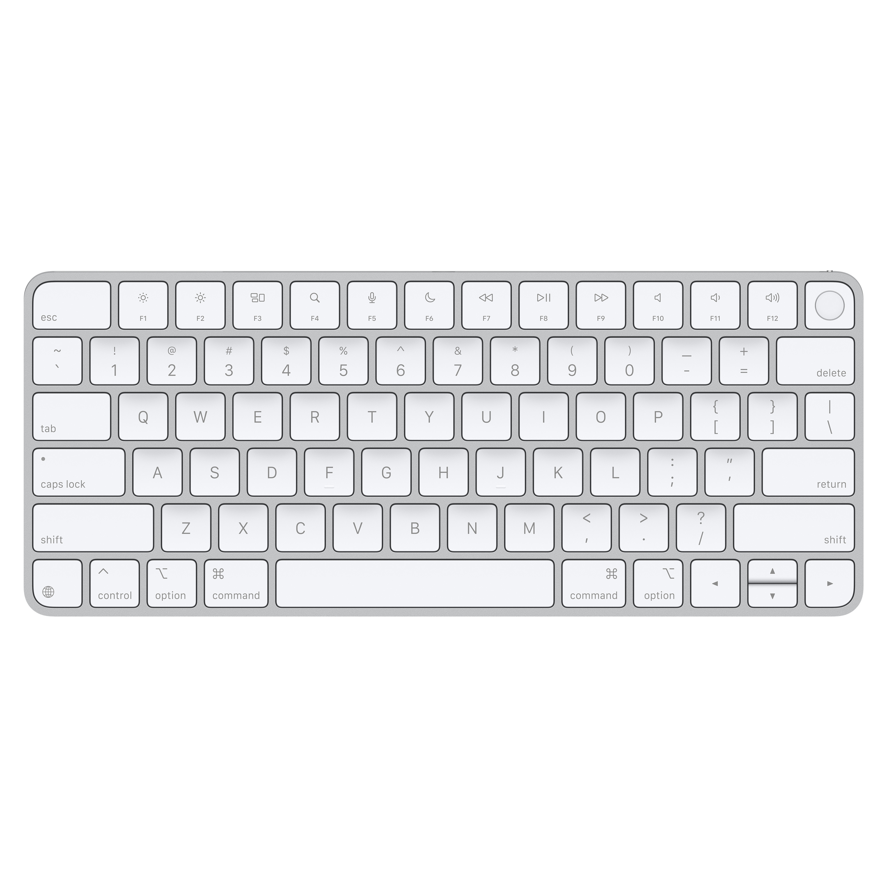

# Experiment No. 2

## Experiment Title
**Demonstration of var, let, const, Template Literals, Destructuring and Billing Calculator using JavaScript**

## Software / Tools Required
1. Visual Studio Code
2. Google Chrome
3. HTML5
4. JavaScript (ES6)

## Theory

JavaScript ES6 introduced several modern features that make programming easier and more efficient.

### a) var
1. Function-scoped variable.
2. Can be redeclared and updated.

### b) let
1. Block-scoped variable.
2. Can be updated but cannot be redeclared in the same scope.

### c) const
1. Block-scoped variable.
2. Cannot be reassigned after initialization.

### d) Template Literals
Template literals allow embedding variables directly inside strings using backticks (`` ` ``) and `${}`.

### e) Destructuring
Destructuring extracts values from arrays or objects into separate variables.

---

## Experiment Program Code

### File: `index.html`

```html
<!doctype html>
<html lang="en">
<head>
  <meta charset="utf-8" />
  <meta name="viewport" content="width=device-width, initial-scale=1" />
  <title>Online Shopping</title>
  <style>
    body {
      font-family: Arial, Helvetica, sans-serif;
      margin: 0;
      color: #1b1b1b;
      background: radial-gradient(circle at 20% 0%, #ffd6e7 0%, rgba(255,214,231,0) 55%),
                  radial-gradient(circle at 100% 10%, #d6f3ff 0%, rgba(214,243,255,0) 55%),
                  linear-gradient(135deg, #f8f9ff 0%, #ffffff 55%, #f2fbff 100%);
      min-height: 100vh;
    }


    header {
      background: #da8dcb;
      color: #fff;
      padding: 16px;
      text-align: center;
    }

    main {
      display: grid;
      grid-template-columns: 1.2fr 0.8fr;
      gap: 16px;
      padding: 16px;
      max-width: 1100px;
      margin: 0 auto;
    }

    @media (max-width: 900px) {
      main {
        grid-template-columns: 1fr;
      }
    }

    section {
      background: #fff;
      padding: 14px;
      border-radius: 8px;
      box-shadow: 0 1px 6px rgba(0,0,0,0.08);
    }

    h2 {
      margin-top: 0;
    }

    .products {
      display: grid;
      grid-template-columns: repeat(3, 1fr);
      gap: 12px;
    }

    @media (max-width: 900px) {
      .products {
        grid-template-columns: repeat(2, 1fr);
      }
    }

    @media (max-width: 520px) {
      .products {
        grid-template-columns: 1fr;
      }
    }

    .product {
      border: 1px solid #eee;
      border-radius: 8px;
      padding: 12px;
      text-align: center;
    }

    .product img {
      width: 100%;
      height: 140px;
      object-fit: cover;
      border-radius: 6px;
      background: #fafafa;
    }

    .product .name {
      font-weight: bold;
      margin-top: 10px;
      margin-bottom: 6px;
    }

    .row {
      display: flex;
      align-items: center;
      gap: 8px;
      justify-content: center;
      margin-top: 10px;
    }

    .row input[type="number"] {
      width: 70px;
      padding: 6px;
    }

    button {
      width: 100%;
      padding: 10px;
      border: none;
      border-radius: 6px;
      background: #aa1caa;
      color: #fff;
      font-size: 15px;
      cursor: pointer;
      margin-top: 10px;
    }

    button:hover {
      background: #084fae;
    }

    .bill-table {
      width: 100%;
      border-collapse: collapse;
      margin-top: 10px;
      font-size: 14px;
    }

    .bill-table th, .bill-table td {
      padding: 8px;
      border-bottom: 1px solid #eee;
      text-align: left;
    }

    .total {
      font-weight: bold;
      font-size: 16px;
    }

    footer {
      text-align: center;
      padding: 16px;
      color: #d25d5d;
    }

    .note {
      font-size: 13px;
      color: #cb6f6f;
      line-height: 1.4;
    }
  </style>
</head>
<body>
  <header>
    <h1>Online Shopping</h1>
  </header>

  <main>
    <section>
      <h2>Products</h2>

      <div class="products">
        <article class="product">
          
          <div class="name">Headphones</div>
          <div>Price: ₹ <span class="price" data-price="799">799</span></div>
          <div class="row">
            <label>Qty</label>
            <input min="0" type="number" class="qty" data-price="799" value="0" />
          </div>
        </article>

        <article class="product">
          
          <div class="name">Smart Watch</div>
          <div>Price: ₹ <span class="price" data-price="1299">1299</span></div>
          <div class="row">
            <label>Qty</label>
            <input min="0" type="number" class="qty" data-price="1299" value="0" />
          </div>
        </article>

        <article class="product">
          
          <div class="name">Backpack</div>
          <div>Price: ₹ <span class="price" data-price="999">999</span></div>
          <div class="row">
            <label>Qty</label>
            <input min="0" type="number" class="qty" data-price="999" value="0" />
          </div>
        </article>

        <article class="product">
          
          <div class="name">Keyboard</div>
          <div>Price: ₹ <span class="price" data-price="699">699</span></div>
          <div class="row">
            <label>Qty</label>
            <input min="0" type="number" class="qty" data-price="699" value="0" />
          </div>
        </article>

        <article class="product">
          
          <div class="name">Mouse</div>
          <div>Price: ₹ <span class="price" data-price="299">299</span></div>
          <div class="row">
            <label>Qty</label>
            <input min="0" type="number" class="qty" data-price="299" value="0" />
          </div>
        </article>

        <article class="product">
          
          <div class="name">Phone Cover</div>
          <div>Price: ₹ <span class="price" data-price="199">199</span></div>
          <div class="row">
            <label>Qty</label>
            <input min="0" type="number" class="qty" data-price="199" value="0" />
          </div>
        </article>
      </div>

    </section>

    <section>
      <h2>Your Bill</h2>
      <div class="note">
        <b>GST: 18%</b>
        <br />
      </div>

      <table class="bill-table" aria-label="Bill details">
        <thead>
          <tr>
            <th>Item</th>
            <th>Qty</th>
            <th>Amount (₹)</th>
          </tr>
        </thead>
        <tbody id="billBody">
        </tbody>
      </table>

      <p style="margin-top: 12px;">
        Subtotal: ₹ <span id="subtotal">0</span>
        <br />
        GST (18%): ₹ <span id="gstAmount">0</span>
        <br />
        <span class="total">Total: ₹ <span id="grandTotal">0</span></span>
      </p>

      <button type="button" id="calcBtn">Calculate Bill</button>
      <button type="button" id="resetBtn" style="background:#6c757d; margin-top:8px;">Reset</button>

      <p class="note" id="message" style="margin-top:12px;"></p>
    </section>
  </main>

  <footer>
    <small>&copy; Ayush Aswale 24070521009</small>
  </footer>

  <script>

    const gstRate = 0.18;

    const billBody = document.getElementById('billBody');
    const subtotalEl = document.getElementById('subtotal');
    const gstAmountEl = document.getElementById('gstAmount');
    const grandTotalEl = document.getElementById('grandTotal');
    const messageEl = document.getElementById('message');
    


    const qtyInputs = Array.from(document.querySelectorAll('.qty'));
    const productArticles = Array.from(document.querySelectorAll('.product'));

    function money(n) {
      return Number(n).toFixed(2);
    }

    function calculateBill() {
      billBody.innerHTML = '';
      messageEl.textContent = '';

      let subtotal = 0;

      productArticles.forEach((article) => {
        const name = article.querySelector('.name').textContent.trim();
        const qtyInput = article.querySelector('.qty');
        const price = Number(qtyInput.getAttribute('data-price'));
        const qty = Number(qtyInput.value || 0);

        const amount = price * qty;
        subtotal += amount;

        if (qty > 0) {
          const tr = document.createElement('tr');

          const tdName = document.createElement('td');
          tdName.textContent = name;

          const tdQty = document.createElement('td');
          tdQty.textContent = qty;

          const tdAmount = document.createElement('td');
          tdAmount.textContent = money(amount);
          tdAmount.style.textAlign = 'right';

          tr.appendChild(tdName);
          tr.appendChild(tdQty);
          tr.appendChild(tdAmount);

          billBody.appendChild(tr);
        }
      });

      const gstAmount = subtotal * gstRate;
      const grandTotal = subtotal + gstAmount;

      subtotalEl.textContent = money(subtotal);
      gstAmountEl.textContent = money(gstAmount);
      grandTotalEl.textContent = money(grandTotal);

      if (subtotal === 0) {
        messageEl.textContent = 'Select quantity for at least one product.';
      } else {
        messageEl.textContent = 'Bill calculated successfully.';
      }
    }

    function resetAll() {
      qtyInputs.forEach((inp) => (inp.value = 0));
      billBody.innerHTML = '';
      subtotalEl.textContent = '0';
      gstAmountEl.textContent = '0';
      grandTotalEl.textContent = '0';
      messageEl.textContent = '';
    }

    document.getElementById('calcBtn').addEventListener('click', calculateBill);
    document.getElementById('resetBtn').addEventListener('click', resetAll);
  </script>
</body>
</html>
```

---

## Output

> **Attach the program output/screenshot.**
>
> The screenshot must clearly display:
> - **Student Name**
> - **PRN**
> - **File Path**

---

## Case Study Title
**Billing Calculator Webpage for a Shopping App**

## Case Study Program Code

### File: `calc/index.html`

```html
<!doctype html>
<html lang="en">
<head>
  <meta charset="utf-8" />
  <meta name="viewport" content="width=device-width, initial-scale=1" />
  <title>GST Billing Calculator</title>
  <link rel="stylesheet" href="styles.css" />
</head>
<body>
  <main class="container">
    <h1>GST Billing Calculator</h1>

    <section class="card">
      <div class="grid">
        <label>
          Customer Name
          <input id="name" type="text" placeholder="Enter customer name" autocomplete="off" />
        </label>

        <label>
          Product
          <input id="product" type="text" placeholder="Enter product name" autocomplete="off" />
        </label>

        <label>
          Price (₹)
          <input id="price" type="number" min="0" step="0.01" placeholder="e.g. 199.99" />
        </label>

        <label>
          Quantity
          <input id="quantity" type="number" min="1" step="1" placeholder="e.g. 2" />
        </label>
      </div>

      <div class="grid">
        <label>
          Discount (%)
          <input id="discount" type="number" min="0" step="0.01" placeholder="e.g. 5" />
        </label>
        <label class="help">
          (Applied on Subtotal)
          <span>Optional</span>
        </label>
      </div>

      <button class="btn" type="button" onclick="calculateBill()">Calculate Bill</button>
    </section>


    <section id="output" class="card output" aria-live="polite"></section>
  </main>

  <footer class="footer">
    <p>
      This website is made by Ayush Aswale V sem PRN: 24070521009, Section A
    </p>
  </footer>

  <script src="bill.js"></script>
</body>
</html>
```

### File: `calc/styles.css`

```css
* { box-sizing: border-box; }

body {
  margin: 0;
  font-family: Arial, Helvetica, sans-serif;
  background: #f6f7fb;
  color: #111827;
}

.container {
  max-width: 860px;
  margin: 40px auto;
  padding: 0 16px;
}

h1 {
  margin: 0 0 16px;
  font-size: 28px;
}

.card {
  background: #ffffff;
  border: 1px solid #e5e7eb;
  border-radius: 12px;
  padding: 16px;
}

.grid {
  display: grid;
  gap: 12px;
  grid-template-columns: repeat(2, minmax(0, 1fr));
}

@media (max-width: 640px) {
  .grid { grid-template-columns: 1fr; }
}

label {
  display: flex;
  flex-direction: column;
  gap: 6px;
  font-weight: 600;
  font-size: 14px;
}

input {
  padding: 10px 12px;
  border-radius: 10px;
  border: 1px solid #d1d5db;
  outline: none;
  font-size: 14px;
}

input:focus {
  border-color: #6366f1;
  box-shadow: 0 0 0 3px rgba(99, 102, 241, 0.15);
}

.btn {
  margin-top: 14px;
  width: 100%;
  border: 0;
  border-radius: 12px;
  padding: 12px 14px;
  font-size: 16px;
  font-weight: 700;
  cursor: pointer;
  background: #4f46e5;
  color: white;
}

.btn:hover {
  background: #4338ca;
}

.output h2,
.output p,
.output h3 {
  margin: 0;
}

.output {
  min-height: 80px;
  margin-top: 16px;
}

.footer {
  max-width: 860px;
  margin: 18px auto 28px;
  padding: 0 16px;
  color: #6b7280;
  font-size: 13px;
}

.footer p {
  margin: 0;
  text-align: center;
}
```

### File: `calc/bill.js`

```javascript
function calculateBill() {
  const customerName = document.getElementById("name").value.trim();
  const product = document.getElementById("product").value.trim();

  const price = Number(document.getElementById("price").value);
  const quantity = Number(document.getElementById("quantity").value);
  let discountPercent = Number(document.getElementById("discount").value || 0);

  const GST = 0.18;

  const outputEl = document.getElementById("output");

  if (Number.isNaN(price) || price < 0) {
    outputEl.innerHTML = `<p style="color:#b91c1c"><b>Error:</b> Please enter a valid <u>Price</u> (₹).</p>`;
    return;
  }

  if (Number.isNaN(quantity) || quantity < 1) {
    outputEl.innerHTML = `<p style="color:#b91c1c"><b>Error:</b> Please enter a valid <u>Quantity</u> (minimum 1).</p>`;
    return;
  }

  if (Number.isNaN(discountPercent) || discountPercent < 0) discountPercent = 0;

  const subtotal = price * quantity;
  const discountAmount = subtotal * (discountPercent / 100);
  const discountedSubtotal = subtotal - discountAmount;
  const gstAmount = discountedSubtotal * GST;
  const total = discountedSubtotal + gstAmount;

  const bill = {
    customerName,
    product,
    subtotal,
    discountPercent,
    discountAmount,
    discountedSubtotal,
    gstAmount,
    total
  };

  const {
    customerName: name,
    product: item,
    subtotal: sub,
    discountPercent: dp,
    discountAmount: da,
    discountedSubtotal: afterDiscount,
    gstAmount: gst,
    total: finalAmount
  } = bill;

  outputEl.innerHTML = `
    <h2>Billing Details</h2>
    <p><b>Customer:</b> ${name || "N/A"}</p>
    <p><b>Product:</b> ${item || "N/A"}</p>

    <p><b>Subtotal:</b> ₹${sub.toFixed(2)}</p>
    <p><b>Discount (${dp.toFixed(2)}%):</b> - ₹${da.toFixed(2)}</p>
    <p><b>After Discount:</b> ₹${afterDiscount.toFixed(2)}</p>
    <p><b>GST (18%):</b> ₹${gst.toFixed(2)}</p>
    <h3>Total Amount: ₹${finalAmount.toFixed(2)}</h3>
  `;

  console.log(`Customer: ${name}`);
  console.log(`Product: ${item}`);
  console.log(`Total Bill: ₹${finalAmount.toFixed(2)}`);
}
```

---

## Output (Case Study)

> **Attach the program output/screenshot.**
>
> The screenshot must clearly display:
> - **Student Name**
> - **PRN**
> - **File Path**

---

## Result / Conclusion

The practical was completed successfully. The concepts of `var`, `let`, `const`, template literals, and destructuring were implemented. A billing calculator was developed that accepts user input such as Customer Name, Phone Number, Address, and Quantity. It calculates GST, Total Price, and Grand Total, and displays the final bill accurately using JavaScript.
